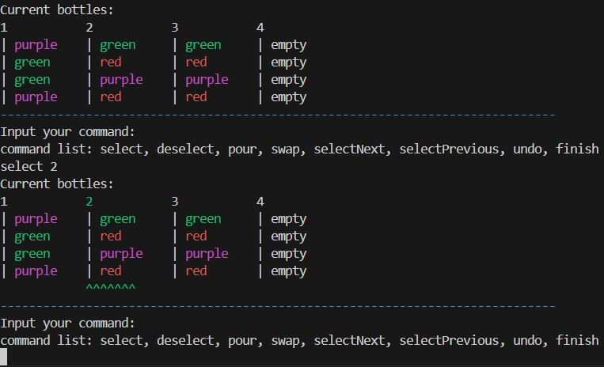

# What is the Water Sort Game?
The water sort game consists of a number of bottles (one plus the number of colors in the game to be precise) where after you the user give the
game the colors that you want to play with and the capacity of your bottles and then the game randomly distributes the colors among the bottles in a way that
there are as many instances of each as the bottle capacity that you set for the game.

# Playing the game
Your goal in this game is to organize the bottles such that each bottle is full and only contains a single color(and one bottle will end up being empty).

There are some rules and commands that you're gonna need to use to achive this goal, first let's list off the commands and the explain the rules of the game

- `select $` This command selects the bottle numbered `$`.
- `selectNext` This command selects the next bottle after the selected bottle and if the final bottle is selected it selects the first bottle.
- `selectPrevious` Works in similar fashion to "selectNext" except that it selects the bottle before the selected bottle.
- `deselect` If a bottle is selected, this command deselects that bottle.
- `swap $` Swaps the current selected bottle with the bottle numbered `$`.
- `pour $` From the current selected bottle, pours onto the bottle numbered `$`.(the conditions of this command are explained in rules section).
- `undo` This command undoes your latest action, however it can only undo up to the last 10 actions and no more.
- `finish` finishes the game.

# Rules
There are some rules that you have to follow alongside the commands that you use for playing.

The first rule is a condition for selecting the bottles, you are not allowed to choose a bottle if it is compeletly empty or it is compeletly full of one color.

Second is the rule for pouring onto bottles. in order to pour from a selected bottle onto your destination bottle some conditions must be fulfilled :

- 1- The top color of the selected bottle must match the top color of the destination bottle or the destination must be compeletly empty.

- 2- The pouring will continue until the destination bottle fills up or we reach a different color in the selected bottle.

- 3- You are not allowed to pour a bottle onto itself.

And the last Rule that you should know is that the game will only end when you win or give the finish command 
otherwise it will continue.

# Implementing the game
The game has been implemented using Java and it runs inside a terminal. The source code is inside the `src` folder and the main class where the code for the game is written, is the WaterSortGame.java class and the other classes are there help the implementation of the game.

The bottles themselves are stored inside a CirculadLinkedList\<Stack\<String\>\> where each stack acts as a bottle and stores the colors inside the bottles as Strings.

The purpose of the Tuple4 class is to create an array of size 10 of 4-tuples(command, indexOfSelectedBottle, argument, numberOfPouredColors) where each item of the array is a command that the player has called. This array is used to implement the undo command of the game.

The WaterSortGame_Player.java class initializes an object of the WaterSortGame class and the game is played by running this class.

### The methods in WaterSortGame.java
Aside from the commands that we've already talked about there are a few methods inside the WaterSortGame class that help run the game or help the commands.

- `display` This method displays the current state of the bottles and gives the player a list of the commands that he can give the game. This method is recalled after every action until the game finishes.

- `isSelectable(Stack bottle)` This method checks if the given bottle fulfills the conditions that a bottle must have in order to be selected and returns true if the bottle is selectable and false if it is not. The `select`, `selectNext` and `selectPrevious` methods all uztilize this method to first check if the bottle that they are going to select is selectable and only then select the bottle.

- `addToActions(String action, int selectedBottle, int argument, int pouredColors)` First this method shifts the entire array to the right so the oldest action is deleted and then adds the new action at index 0.

- `shiftLeftActions` Shifts the actions array to the left and makes index 9 of the array, ("nofunc",-1,-1,-1) 4-tuple. This method is called every time the undo method, undoes a certain action (the undo method always undoes the index 0 of the actions array that's why we at every undo we shift the array to left).

- `hasWon` Checks the current state of all the bottles to see if the game has finished or not. returns true if finished and false otherwise.

- `playGame` Asks the user to start the game and if the player starts the game, it calls the gaming() method.

- `gaming` This is the main method that runs the game and keeps it going using a while loop, displays the bottles and takes the 
player's command at every turn of the game. This method stops once the game has finished by either the finish command or the 
hasWon() method.

- `pourUndo` This method simply helps the undo method, undo the pouring action.

> another thing to note is that the normal command functions, if executed properly, will call the addToActions() method and 
add the current action to the actions array.

### Extra methods in CircularSinglyLinkedList.java
Aside from the usual methods that you would expect to see in a linked list class, there are some extra ones that have been defined in order to assist the implementation of the methods inside WaterSortGame.java

- `getItemAt(int index)` This method returns the item at the given index(Not the node but the item stored inside the node, index starts from 0.)

- `getIndexOf(item)` Searches the list for the given item and when the item is found, it returns the index at which the item
resides(returns -1 if the item is unavailable.)

- `getNextItem(item)` returns the item that appears inside the linked list after the given item(Since the list is implemented 
in a circular manner if the item at tail is the given item, returns the item at the head of the linked list).

- `gePreviousItem(item)` Functions in similar fashion to the `getNextItem()` method except it returns the item before the given 
item instead of the next one.

## Examples

Selecting a bottle using the select command.
